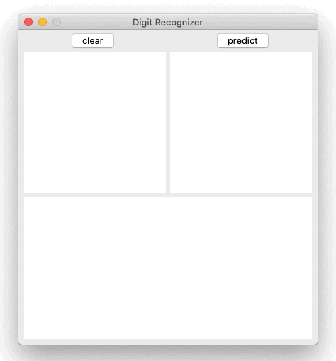

# Digit Recognizer
Interface to visualize CNN predictions of digits drawn by the user.

<p align="center">
    
</p>
The top-left square is the canvas, in which a number between 0 and 9 is expected. The top-right shows the input to the CNN: the drawing has been reduced to have a size 28x28. The bottom plot shows the probabilities predicted by the CNN.


## Installation

To install the dependencies, run the following command:

```bash
pip install -r requirements.txt
```

Current version has been tested on Python 3.7.7. Changes in the GUI appearance may happen in lower versions.


## Usage

To run the GUI:

```python
python digit_recognizer.py
```

`model/` contains a trained CNN. You change the architecture or the parameters in `cnn_model.py`. To train it run:

```python
python cnn_model.py
```
`prediction/` stores the input and the scores for the last prediction.
